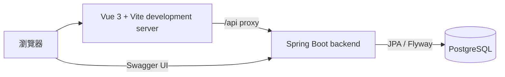
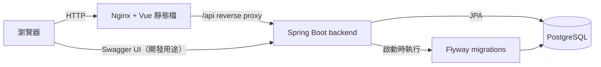
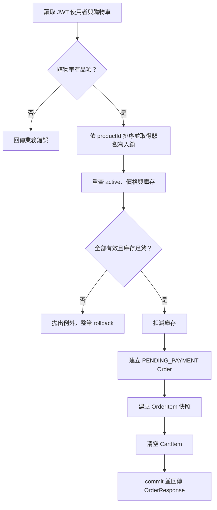

# ShopFlow 架構說明

## 架構原則

ShopFlow 是前後端分離的模組化單體。Vue SPA 只透過 REST API 存取單一 Spring Boot backend；backend 是唯一可以讀寫 PostgreSQL 的元件。功能分包是程式碼組織方式，不代表獨立部署或微服務。

## 執行架構

### 本機直接開發

Vite `/api` proxy 只用於本機 development server，避免前端開發時硬編碼 backend URL。

### Docker Compose 完整啟動

完整啟動時，frontend image 先建置 Vue 靜態檔，再由 Nginx 提供。Nginx 將 `/api` 反向代理至 Docker network 內的 backend service；其餘路徑回傳 SPA 靜態檔並支援 Vue Router history fallback。

Vite proxy 與 Nginx reverse proxy 是互斥的執行路徑：前者只服務直接開發，後者服務完整 Compose。正式 runtime 不啟動 Vite development server。

## 後端模組

| 模組 | 責任 |
| --- | --- |
| `auth` | 註冊、登入、BCrypt、JWT 建立與 principal 解析 |
| `catalog` | Category、公開商品查詢、搜尋、篩選與分頁 |
| `cart` | 使用者自己的 Cart 與 CartItem |
| `order` | 下單交易、OrderItem 快照、模擬付款與自己的訂單查詢 |
| `admin` | 商品管理、庫存調整、全部訂單查詢及狀態管理 |
| `security` | Spring Security filter chain、JWT 驗證及角色規則 |
| `error` | 全域例外處理與統一錯誤 DTO |

Controller 只負責 HTTP、DTO 與輸入驗證；Service 負責授權後的商業規則和交易；Repository 負責資料存取。Entity 不得離開 backend persistence/service 邊界。

## 驗證與授權資料流

1. 使用者登入後取得短效 JWT Access Token。
2. 前端以 `Authorization: Bearer <token>` 呼叫受保護 API。
3. backend 驗證簽章與期限，從 JWT principal 取得 userId 與單一角色。
4. CUSTOMER 只能操作自己的 Cart、CartItem、Order；查詢其他使用者資源一律視為不存在並回傳 404。
5. ADMIN 才能存取 `/api/admin/**`。任何 request body 或 query 中的角色及 userId 都不具授權效力。

JWT 使用 HS256；secret 只由環境變數提供。第一版不提供 refresh token 或撤銷清單，角色變更最遲在既有 token 到期後生效。

## 建立訂單交易

`POST /api/orders` 不接收商品價格、總價或 userId，也不接收自行挑選的商品清單；訂單來源是 JWT 使用者目前的整個購物車。

以下操作必須位於同一個 database transaction：

1. 檢查並扣減所有商品庫存。
2. 建立 Order。
3. 建立所有 OrderItem 快照。
4. 清空該使用者購物車。

任何驗證、寫入或刪除失敗時，訂單、訂單品項、庫存及購物車變更全部 rollback，不允許部分成功。

為降低多商品訂單死鎖風險，商品一律依 productId 排序後鎖定。待付款訂單已占用並扣減庫存；第一版不做逾時自動取消。

## 模擬付款與取消

- `POST /api/orders/{orderId}/pay` 只允許訂單本人將 `PENDING_PAYMENT` 轉為 `PAID`。
- 模擬付款固定成功，不處理或儲存任何卡號，也不建立 Payment entity。
- 只有 `PENDING_PAYMENT`、`PAID`、`PROCESSING` 可轉為 `CANCELLED`。
- `SHIPPED` 與 `COMPLETED` 不可取消；非法轉移回傳 409。
- 取消時在單一交易內鎖定 Order。若狀態已是 `CANCELLED`，直接回傳目前結果且不再異動庫存；否則鎖定相關 Product、回補每個 OrderItem 的數量，再把狀態改為 `CANCELLED`。
- Order row lock 與 `CANCELLED` 狀態共同構成冪等門檻，確保重複或併發取消只回補一次。

## 商品可見性與歷史資料

- 公開列表與詳情只查詢 `active = true` 的商品；inactive 或不存在商品一律回傳 404。
- ADMIN 商品端點可以查詢 active 與 inactive 商品。
- 商品刪除只將 `active` 設為 `false`，不物理刪除。
- OrderItem 保存 `productId`、`productName`、`unitPrice`、`quantity`、`subtotal`。歷史訂單顯示一律使用快照欄位，不重新採用目前 Product 名稱或價格。

## 設定與敏感資料

資料庫連線、資料庫密碼、JWT secret、允許的 CORS origins 與管理維運所需敏感值皆由環境變數提供。實際 `.env` 不得提交；repository 只允許未含真實值的 `.env.example` 在未來另行建立。

第一個 ADMIN 不由公開 API 建立。先註冊一般帳號，再透過受控資料庫維運操作將角色調整為 `ADMIN`。
