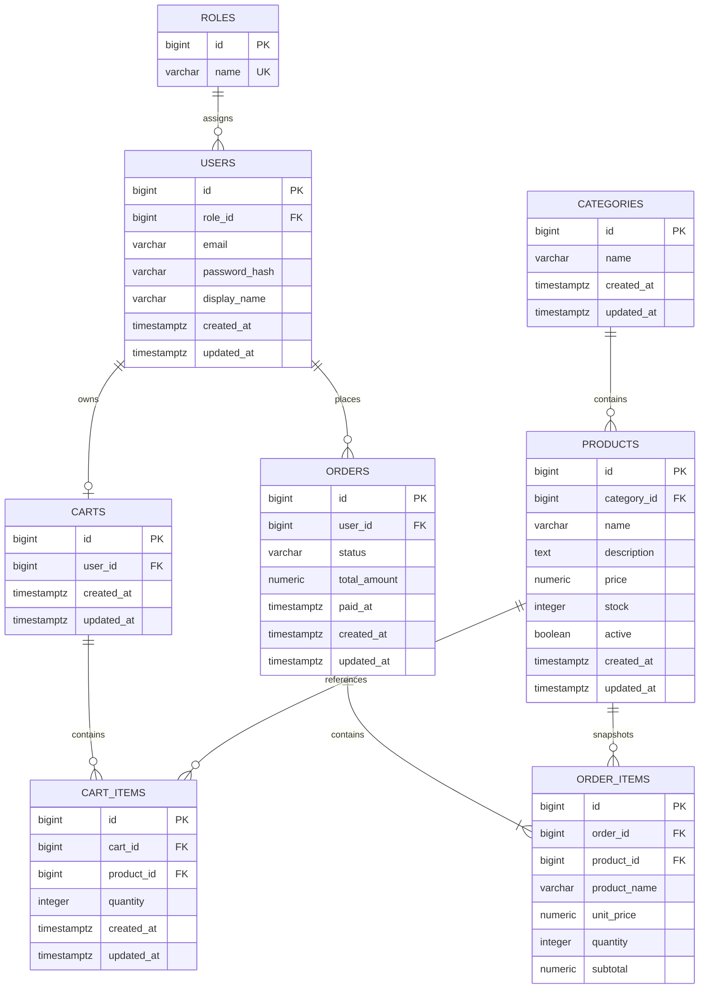

# ShopFlow ERD

## 關聯圖

實際資料表使用複數 snake_case 名稱，避免 `user`、`order` 等保留字問題。

## 資料表定義

### `roles`

| 欄位 | 型別 | 規則 |
| --- | --- | --- |
| `id` | `BIGINT` | PK，自動產生 |
| `name` | `VARCHAR(30)` | NOT NULL、UNIQUE，只使用 `CUSTOMER`、`ADMIN` |

Flyway 建立兩個固定角色。每位 User 只有一個角色；公開註冊永遠指定 `CUSTOMER`。

### `users`

| 欄位 | 型別 | 規則 |
| --- | --- | --- |
| `id` | `BIGINT` | PK，自動產生 |
| `role_id` | `BIGINT` | NOT NULL，FK → `roles.id` |
| `email` | `VARCHAR(254)` | NOT NULL，以小寫正規化 |
| `password_hash` | `VARCHAR(255)` | NOT NULL，只保存 BCrypt hash |
| `display_name` | `VARCHAR(100)` | NOT NULL |
| `created_at`、`updated_at` | `TIMESTAMPTZ` | NOT NULL |

唯一索引：`ux_users_email_lower` 作用於 `lower(email)`，避免大小寫不同的重複帳號。

### `categories`

| 欄位 | 型別 | 規則 |
| --- | --- | --- |
| `id` | `BIGINT` | PK，自動產生 |
| `name` | `VARCHAR(100)` | NOT NULL |
| `created_at`、`updated_at` | `TIMESTAMPTZ` | NOT NULL |

分類名稱使用 `lower(name)` 唯一索引。第一版分類由 Flyway 初始資料提供，不提供分類管理 API。

### `products`

| 欄位 | 型別 | 規則 |
| --- | --- | --- |
| `id` | `BIGINT` | PK，自動產生 |
| `category_id` | `BIGINT` | NOT NULL，FK → `categories.id` |
| `name` | `VARCHAR(200)` | NOT NULL |
| `description` | `TEXT` | NOT NULL |
| `price` | `NUMERIC(12,2)` | NOT NULL，`price > 0` |
| `stock` | `INTEGER` | NOT NULL，`stock >= 0` |
| `active` | `BOOLEAN` | NOT NULL，預設 true |
| `created_at`、`updated_at` | `TIMESTAMPTZ` | NOT NULL |

索引至少包含 `(active, category_id)`。第一版搜尋使用 `ILIKE` 比對名稱與描述；確認資料量需要後才加入全文或 trigram index。

商品不物理刪除。公開查詢只讀取 active 商品；ADMIN 查詢可包含 inactive 商品。

### `carts`

| 欄位 | 型別 | 規則 |
| --- | --- | --- |
| `id` | `BIGINT` | PK，自動產生 |
| `user_id` | `BIGINT` | NOT NULL、UNIQUE，FK → `users.id` |
| `created_at`、`updated_at` | `TIMESTAMPTZ` | NOT NULL |

Cart 可於註冊時或首次存取時建立，但每位 User 最多只能有一個 Cart。

### `cart_items`

| 欄位 | 型別 | 規則 |
| --- | --- | --- |
| `id` | `BIGINT` | PK，自動產生 |
| `cart_id` | `BIGINT` | NOT NULL，FK → `carts.id` |
| `product_id` | `BIGINT` | NOT NULL，FK → `products.id` |
| `quantity` | `INTEGER` | NOT NULL，`quantity > 0` |
| `created_at`、`updated_at` | `TIMESTAMPTZ` | NOT NULL |

UNIQUE (`cart_id`, `product_id`) 確保同一商品在購物車中只有一筆。CartItem 不保存價格；購物車金額只供顯示，下單時必須重新計算。

### `orders`

| 欄位 | 型別 | 規則 |
| --- | --- | --- |
| `id` | `BIGINT` | PK，自動產生 |
| `user_id` | `BIGINT` | NOT NULL，FK → `users.id` |
| `status` | `VARCHAR(30)` | NOT NULL，受 CHECK constraint 限制 |
| `total_amount` | `NUMERIC(12,2)` | NOT NULL，`total_amount >= 0` |
| `paid_at` | `TIMESTAMPTZ` | nullable，只在付款成功後設定 |
| `created_at`、`updated_at` | `TIMESTAMPTZ` | NOT NULL |

合法狀態只有 `PENDING_PAYMENT`、`PAID`、`PROCESSING`、`SHIPPED`、`COMPLETED`、`CANCELLED`。索引包含 `(user_id, created_at DESC)` 及 `(status, created_at DESC)`。

### `order_items`

| 欄位 | 型別 | 規則 |
| --- | --- | --- |
| `id` | `BIGINT` | PK，自動產生 |
| `order_id` | `BIGINT` | NOT NULL，FK → `orders.id` |
| `product_id` | `BIGINT` | NOT NULL，FK → `products.id` |
| `product_name` | `VARCHAR(200)` | NOT NULL，建立訂單時的名稱快照 |
| `unit_price` | `NUMERIC(12,2)` | NOT NULL，`unit_price > 0` |
| `quantity` | `INTEGER` | NOT NULL，`quantity > 0` |
| `subtotal` | `NUMERIC(12,2)` | NOT NULL，`subtotal >= 0` |

`product_id` 保存原始商品識別並支援取消時回補庫存；`product_name`、`unit_price`、`quantity`、`subtotal` 是不可變快照。歷史訂單顯示只能使用這些快照欄位。

## 交易與一致性

- 下單時依 productId 排序取得 Product 悲觀寫入鎖，再驗證 active、目前價格及庫存。
- 扣庫存、建立 Order、建立 OrderItem 與清空 CartItem 位於同一交易，失敗全部 rollback。
- 取消時鎖定 Order。只有 `PENDING_PAYMENT`、`PAID`、`PROCESSING` 可變更為 `CANCELLED`。
- 每筆合法取消只回補一次庫存；Order row lock 與持久化的 `CANCELLED` 狀態共同防止重複回補。
- 已是 `CANCELLED` 的重複取消是無副作用操作；`SHIPPED`、`COMPLETED` 的取消要求回傳衝突，兩者都不得回補庫存。
